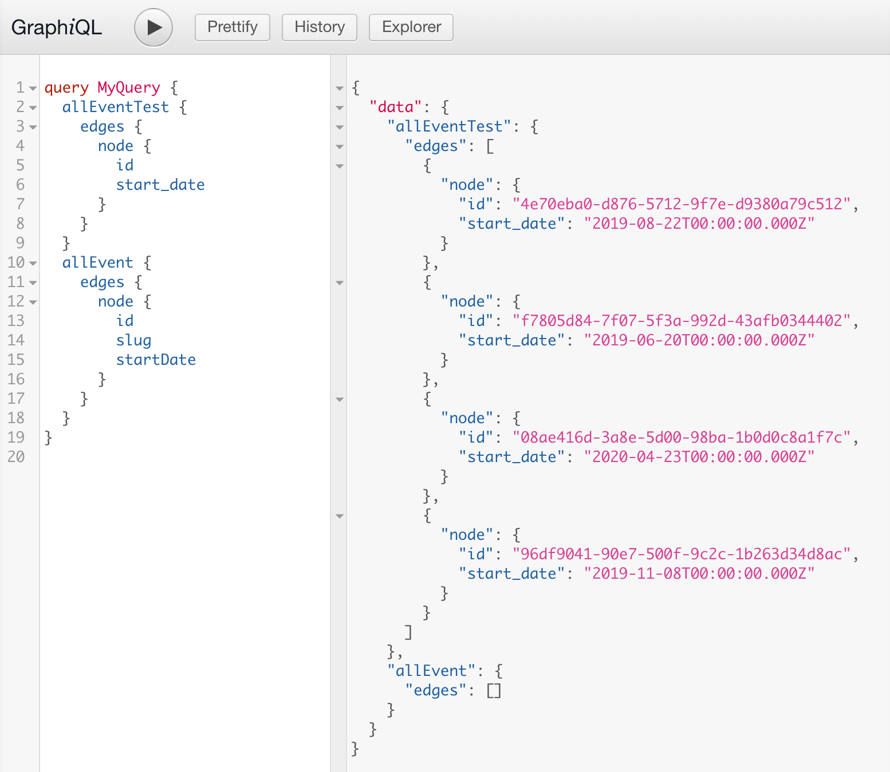

# Build Gatsby Theme

## References

- [Building a Theme](https://www.gatsbyjs.org/tutorial/building-a-theme/)
- [Gatsby Theme Authoring](https://egghead.io/courses/gatsby-theme-authoring)

## Lesson 1 - Set up yarn workspaces

创建 site 和 gatsby-theme-events 两个目录，即 workspace，分别有自己的 package.json，根目录下还有自己的 package.json。

```shell
$ yarn workspaces info
$ yarn workspace site add gatsby react react-dom "gatsby-theme-events@*"
$ yarn workspace gatsby-theme-events add -P react react-dom gatsby
$ yarn workspace gatsby-theme-events add -D react react-dom gatsby
$ yarn workspace site develop
$ yarn workspace gatsby-theme-events develop
$ yarn workspaces info
```

## Lesson 2 - Add static data to a theme

在 gatsby-theme-events 下创建 data/events.yaml 文件。

安装 gatsby-source-filesystem 及 gatsby-transformer-yaml 来解析 yaml 文件。

```js
module.exports = {
  plugins: [
    {
      resolve: 'gatsby-source-filesystem',
      options: {
        path: 'data'
      }
    },
    {
      resolve: 'gatsby-transformer-yaml',
      options: {
        typeName: 'Event'
      }
    }
  ]
}
```

typeName 的作用，如果不指定 typeName，GraphQL 查询时是这样查的：

```graphql
{
  allEventsYaml {
    ...
  }
}
```

query name 是文件的名字，指定 typeName 后是这样查询：

```graphql
{
  allEvent {
    ...
  }
}
```

作用也不仅于此，在下面一小节在 sourceNodes 中也会用到这个 type。

运行 `yarn workspace gatsby-theme-events develop` 后打开 http://localhost:8000/___graphql 进行验证。

## Lesson 3 - Create a data directory using the onPreBootstrap lifecycle

当 gatsby-theme-events theme 发布时，很有可能并不会带上 data 目录，而是要求使用者在自己的项目中创建 data 目录并填充数据，如果使用者没有创建 data 目录，gatsby-source-filesystem 就会报错并终止。我们可以在 gatsby-node.js 中使用 onPreBootstrap lifecycle 方法来判断有没有 data 目录，如果没有就为用户创建此目录。

创建 gatsby-node.js 文件并实现 onPreBootstrap 方法：

```js
const fs = require('fs')

// Make sure the data directory exists
exports.onPreBootstrap = ({ reporter }) => {
  const contentPath = 'data'

  if (!fs.existsSync(contentPath)) {
    reporter.info(`creating the ${contentPath} directory`)
    fs.mkdirSync(contentPath)
  }
}
```

## Lesson 4 - Set up to create data-driven pages

在 gatsby-node.js 中实现 sourceNodes 和 createResolvers 方法，添加 Event 类型的 node，并给这类 node 添加并实现 slug 属性。

```js
// gatsby-node.js
...
// Define the "Event" type
exports.sourceNodes = ({ actions }) => {
  actions.createTypes(`
    type Event implements Node @dontInfer {
      id: ID!
      name: String!
      location: String!
      startDate: Date! @dateformat @proxy(from: "start_date")
      endDate: Date! @dateformat @proxy(from: "end_date")
      url: String!
      slug: String!
    }
  `)
}

// Define resolvers for custom fields
exports.createResolvers = ({ createResolvers }) => {
  const basePath = "/"
  // Quick-and-dirty helper to convert strings into URL-friendly slugs.
  const slugify = str => {
    const slug = str
      .toLowerCase()
      .replace(/[^a-z0-9]+/g, "-")
      .replace(/(^-|-$)+/g, "")
    return `/${basePath}/${slug}`.replace(/\/\/+/g, "/")
  }
  createResolvers({
    Event: {
      slug: {
        resolve: source => slugify(source.name),
      },
    },
  })
}
```

这一小节不是很好理解的一点就是 yaml 和 Event 是怎么关联上的。应该就是依靠 lesson 2 中在 gatsby-transformer-yaml 中配置的 `typeName: "Event"` 关联的吧。

做个实验，所 typeName 换个名字呢。把 typeName 改成 EventTest 后，在 GraphiQL 中会发现，allEventTest 和 allEvent 2 个字段同时存在，但后者的数据变成空了，前者的数据即为 yaml 文件中的数据。



所以我理解整个流程是这样的，首先 gatsby-transformer-yaml 插件工作，它也会使用 actions.createTyeps() 方法创建 Node，这个 Node 的类型由 config 中的 typeName 决定，如果没有在 config 中设置 typeName，则其类型由文件名决定。(但看了源码 - https://github.com/gatsbyjs/gatsby/blob/master/packages/gatsby-transformer-yaml/src/gatsby-node.js 后并非如此，源码中使用了 createNode API - https://www.gatsbyjs.org/docs/actions/#createNode 创建 Node，有待进一步深入学习。)

然后就是项目自身的 gatsby-node.js 中的 sourceNodes 工作，使用 actions.createTypes() 可以定义相同类型的 Node。

## Lesson 5 - Create data-driven pages using GraphQL and createPages

(剩下的流程和以前手动一步一步创建 gatsby site 的步骤差不多)

在 gatsby-node.js 中实现 createPages 方法，在这个方法中获取所有的 events，对每个 event 依次调用 createPage 方法，然后创建相应的 templates，layout，components ...

- src/template/events.js - 获取所有 events，通过 components/event-list.js 显示 events 列表
- src/template/event.js - 获取单个 event 详情，通过 components/event.js 显示单个 event
- src/components/layout.js
- src/components/event-list.js
- src/components/event.js

```js
exports.createPages = async ({ actions, graphql, reporter }) => {
  const basePath = '/'
  actions.createPage({
    path: basePath,
    component: require.resolve('./src/templates/events.js')
  })
  const result = await graphql(`
    query {
      allEvent(sort: { fields: startDate, order: ASC }) {
        nodes {
          id
          slug
        }
      }
    }
  `)
  if (result.errors) {
    reporter.panic('error loading events', result.errors)
    return
  }
  const events = result.data.allEvent.nodes
  events.forEach(event => {
    const slug = event.slug
    actions.createPage({
      path: slug,
      component: require.resolve('./src/templates/event.js'),
      context: {
        eventID: event.id
      }
    })
  })
}
```

稍微与之前的流程不太一样的地方是，在这里，显示 events 列表的页面也在 createPages 中生成，而在原来的流程中，这个 events 列表的页面是通过 src/pages/events.js 约定式路由自动生成的。

## Lesson 6 - Display and query data by id with context and static queries

获取单个 event 的详情并显示。和以前的流程一样。通过在 src/template/event.js 中使用 graphql 查询 event 详情，将 event 详情作为 props 传递给 src/components/event.js 显示。

```js
// src/template/event.js
import React from 'react'
import { graphql } from 'gatsby'
import Layout from '../components/layout'
import Event from '../components/event'

export const query = graphql`
  query($eventID: String!) {
    event(id: { eq: $eventID }) {
      name
      url
      startDate(formatString: "MMMM DD YYYY")
      endDate(formatString: "MMMM DD YYYY")
      location
      slug
    }
  }
`
const EventTemplate = ({ data: { event } }) => (
  <Layout>
    <Event {...event} />
  </Layout>
)

export default EventTemplate
```

## Lesson 7 - Style and format dates in React

略。

## Lesson 8 - Configure a theme to take options

让 theme 支持接收 config options。

修改 gatsby-theme-events/gatsby-config.js，将 hard code 的 path 变成从参数中接收。

```js
module.exports = ({ contentPath = 'data', basePath = '/' }) => ({
  plugins: [
    {
      resolve: 'gatsby-source-filesystem',
      options: {
        path: contentPath
      }
    },
    {
      resolve: 'gatsby-transformer-yaml',
      options: {
        typeName: 'Event'
      }
    }
  ]
})
```

修改 gatsby-theme-events/gatsby-node.js，增加 options 参数。

```js
exports.onPreBootstrap = ({ reporter }, options) => {
  const contentPath = options.contentPath || 'data'
  // {...}
}
exports.sourceNodes = ({ actions }) => {
  // {...}
}
exports.createResolvers = ({ createResolvers }, options) => {
  const basePath = options.basePath || '/'
  // {...}
}
exports.createPages = async ({ actions, graphql, reporter }, options) => {
  const basePath = options.basePath || '/'
  // {...}
}
```

设置 site/gatsby-config.js，使用 gatsby-theme-events 的 options。

```js
module.exports = {
  plugins: [
    {
      resolve: 'gatsby-theme-events',
      options: {
        contentPath: 'events',
        basePath: '/events'
      }
    }
  ]
}
```

启动 `yarn workspace site develop` 后看效果，会发现在 site 目录下自动创建了 events 目录，这个目录用来存放 yaml 数据文件，把 gatsby-theme-events/data 下的 yaml 拷贝到 site/events 目录下，访问 localhost:8000/404 可以看到生成的所有路由，发现所有路由都加上了 `/events` 前缀。

如下所示：

- /events
- /events/dinosaurjs
- /events/react-rally
- /events/the-lead-developer
- /events/jsheroes

而修改之前启动 `yarn workspace gatsby-theme-events develop` 后默认生成的路由是：

- /
- /dinosaurjs
- /react-rally
- /the-lead-developer
- /jsheroes

(经过上面的修改后由于 gatsby-theme-events 在 gatsby-config.js 导出的是一个函数而不是一个 object，因此无法再通过 `yarn workspace gatsby-theme-events develop` 单独启动了，只能作为一个 lib 使用)

## Lesson 9 - Make themes extendable with gatsby-plugin-theme-ui

使用 gatsby-plugin-theme-ui (对 theme-ui 的封装) lib 定义全局的 css style theme。(头大了，css 的方案太多了，之前的教程中使用的是 Typography.js，这又冒出一个新的 theme-ui ... 虽然对这个库不是很感冒，还是照着流程跑一遍吧)

添加相应的依赖：

```shell
yarn workspace gatsby-theme-events add gatsby-plugin-theme-ui theme-ui @emotion/core @emotion/styled @mdx-js/react
```

在 gatsby-theme-events/gatsby-config.js 中声明使用这个 plugin:

```js
module.exports = ({ contentPath = "data", basePath = "/" }) => ({
  plugins: [
    "gatsby-plugin-theme-ui",
    ...
  ],
})
```

在 gatsby-theme-events/src/theme.js 中定义全局的 css style theme:

```js
export const theme = {
  space: [0, 4, 8, 16, 32],
  fonts: {
    body: "-apple-system, BlinkMacSystemFont, Segoe UI, Roboto, sans-serif",
  },
  fontSizes: [16, 18, 20, 22, 27, 36],
  ...
}
export default theme // 为什么还要导出一个 default?
```

(目前这个 theme.js 还没起作用。)

## Lesson 10 - Use and override a theme with component shadowing

在 gatsby-theme-events/src 下新建 gatsby-plugin-theme-ui 目录，在此目录下新建 index.js，在 index.js 中使用上一步我们自定义的 theme.js 来覆写默认的 css style theme。

```js
import { theme } from '../theme'
export default theme
```

(用这种方法来覆写默认 global css style ... 私以为还是 Typography.js 使用 API 来覆写更优雅一些。但上面这种方法在 react 中也挺常见，待举其它例子。而且也是 gatsby theme 实现 component 覆写的方法，后面会讲到。)

使用 theme-ui 中的一些 component 来改造 layout.js。

```js
import React from 'react'
import { Layout as ThemeLayout, Header, Main, Container } from 'theme-ui'

const Layout = ({ children }) => {
  return (
    <ThemeLayout>
      <Header>Gatsby Events Theme</Header>
      <Main>
        <Container>{children}</Container>
      </Main>
    </ThemeLayout>
  )
}

export default Layout
```

用 theme-ui 中的 Styled component (Styled.h1, Styled.ul, Styled.li ...) 改造 event-list.js，代码略。

运行 `yarn workspace site develop` 看效果。

## Lesson 11 - Publish a theme to npm

跳过。需要 publish 一个包到 npm 时再看。

上面的 gatsby-theme-events 被发布成了 `@jlengstorf/gatsby-theme-events`。

## Lesson 12 - Consume a theme in a Gatsby application

在你的 gatsby 项目中使用 gatsby theme。

一个最简单的 gatsby 项目只需要一个 gatsby-config.js 和一个 package.json 文件就行，在 gatsby-config.js 中声明使用的 gatsby theme，然后就可以用 `gatsby develop` 跑起来了。

```shell
$ mkdir theme-test
$ cd theme-test
$ yarn init -y
$ yarn add react react-dom gatsby @jlengstorf/gatsby-theme-events
```

配置 theme-test/gatsby-config.js。

```js
module.exports = {
  plugins: ['@jlengstorf/gatsby-theme-events']
}
```

运行。

```shell
$ yarn gloabl add gatsby-cli
$ gatsby develop
```

跑起来后根据前面的逻辑，在 theme-test 下会自动生成空的 data 目录，在此目录下你可以放置相应的 yaml 数据文件。

## Lesson 13 - Use component shadowing to override theme components

覆写 gatsby theme 中默认的 css style theme 和 component (比如 Layout, EventList, Event component 等)。

方法就是在自己项目的 src 目录下，创建和 gatsby theme 中同名的目录及文件，就可以覆盖掉 gatsby theme 中的实现。

比如覆写 gatsby-theme-events 中的 css style theme，那我们就在 theme-test 下创建 src/gatsby-plugin-theme-ui/index.js。

覆写 gatsby-theme-events 中的 Layout component，那我们就在 theme-test 下创建 src/@jlengstorf/gatsby-theme-events/components/layout.js 并重新实现之。

目录结构：

```
.
├── data
│   └── events.yml
├── src
│   ├── @jlengstorf
│   │   └── gatsby-theme-events
|   |       └── components
|   |           └── layout.js
│   └── gatsby-plugin-theme-ui
│       └── index.js
├── .gitignore
├── gatsby-config.js
├── package.json
└── yarn.lock
```

```js
// theme-test/src/gatsby-plugin-theme-ui/index.js
import merge from 'lodash.merge' // 要 yarn add lodash.merge
import { theme } from '@jlengstorf/gatsby-theme-events'

export default merge({}, theme, {
  colors: {
    primary: 'blue'
  }
})
```

```js
// theme-test/src/@jlengstorf/gatsby-theme-events/components/layout.js
import React from 'react'

export default ({ children }) => <>{children}</>
```

## Conclusion

整个教程很详细，也很好理解，而且 gatsby theme 的实现也不复杂。

有了这个 theme 以后，gatsby 就可以像 jekyll / hugo 等其它静态建站工具一样，开箱即用，再也不用像以前那样先要来上十几个麻烦的步骤后才能真正跑起来。

awesome!
